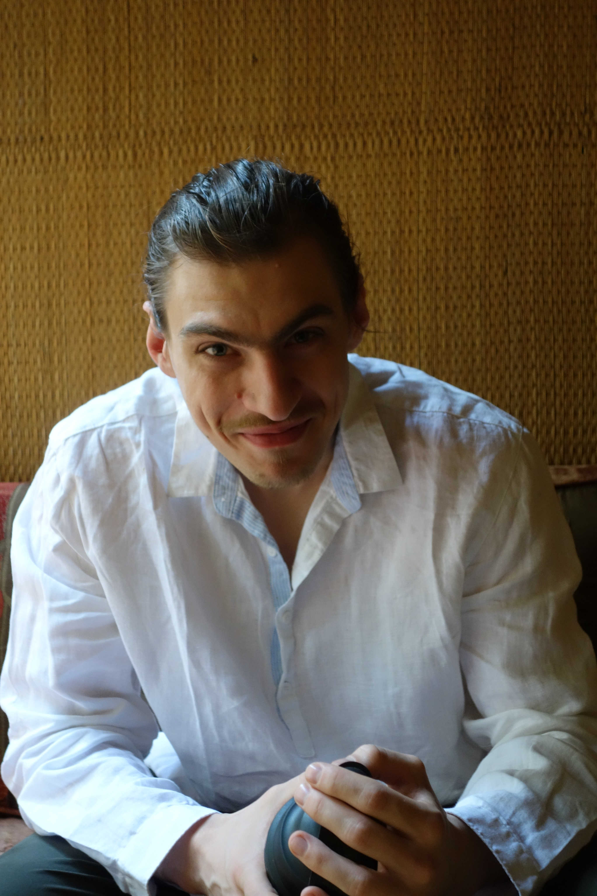

My name is Marcin and I am a postdoctoral researcher at [Max Planck Institute for Mathematics in the Sciences](https://www.mis.mpg.de/). My research focuses on developing efficient, robust and scalable statistical methods for various problems involving stochastic processes. I completed my PhD under the supervision of [Dr Paul Jenkins](https://warwick.ac.uk/fac/sci/statistics/staff/academic-research/jenkins/), [Dr Murray Pollock](https://warwick.ac.uk/fac/sci/statistics/staff/academic-research/pollock/) and [Prof Gareth Roberts](https://warwick.ac.uk/fac/sci/statistics/staff/academic-research/roberts/) as part of the [OxWaSP programme](http://www.oxwasp-cdt.ac.uk/)---a centre for doctoral training (CDT) programme run jointly by the University of Warwick and the University of Oxford. Previously, I studied at the University of Warwick, where I obtained a degree of [Bachelor of Science and Master of Mathematics, Operational Research, Statistics and Economics (MORSE)](https://warwick.ac.uk/fac/sci/statistics/courses/morse/).

### Professional Interests
* Computational methods for stochastic processes
* MCMC methods
* Simulation of conditioned diffusions (diffusion bridges)
* Inference for stochastic processes
* Stochastic analysis
* Bayesian statistics
* Machine learning

### Education
* PhD in Statistics, 2019 (currently awaiting my viva) (University of Warwick, UK)
* BSc, Master of MORSE, 2015 (University of Warwick, UK)
